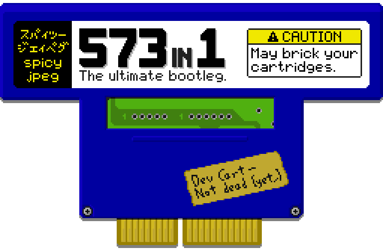

  

573in1 is a full-featured homebrew maintenance and troubleshooting tool, game
installer and BIOS ROM replacement for arcade games based on Konami's System 573
PCB, such as earlier versions of Dance Dance Revolution and other Bemani rhythm
games from the same era. It currently allows for:

- dumping, erasing and writing images to the onboard flash memory, PCMCIA flash
  cards and RTC RAM;
- dumping security cartridge EEPROMs and editing the serial number stored in
  them in order to reinstall a game on a different system;
- repurposing cartridges for use with any game that uses the same cartridge
  type;
- browsing the CD-ROM, or any attached IDE hard drive or CF card, and launching
  System 573 and PS1 executables.

## Download and usage

The latest version of 573in1 can be found on the releases page, accessible
through the GitHub sidebar. The tool is available in three different formats:

- as a CD-ROM image, usable on any 573 equipped with a CD-ROM drive (including
  ones fitted with BIOS mod boards);
- as a BIOS ROM image, allowing the system to boot directly into the 573in1 main
  menu (even with no IDE drives connected) and optionally launch a game or
  custom executable automatically;
- as a standalone 573 executable for advanced users.

See the [documentation](doc/index.md) for more information and usage
instructions. Reading the documentation before proceeding is highly recommended.

## Contributing

Pull requests are welcome. If you wish to add functionality (e.g. game-specific
menus to manipulate user data, extract assets and so on) feel free to do so,
however please stick to the following guidelines:

- Do not include any code lifted as-is or minimally modified from a game
  disassembly. Rewritten and properly explained/commented code is fine.
- Do not include any Konami game files or excerpts thereof. If necessary, only
  include metadata about the files such as hashes, offsets, sizes and so on.
- Store any such metadata as a file in the resource archive (see
  `resources.json`) rather than hardcoding it. If possible, provide a copy of
  the scripts used to gather the data from the original files in the `tools`
  directory.
- Adding a section to the documentation covering usage of the newly added
  functionality is not required, but would be highly appreciated.

## License

The tool is licensed under the [GNU GPLv3](LICENSE). You may freely distribute
modified versions as long as you also provide the full source code, attribution
and a link back to this repository.

## See also

- Naoki Saito's 573 resources:
  - [Konami's System 573 - Everything you wanted to know about it!](https://youtube.com/watch?v=Cm6ycmTbwIU)
  - [System 573 repo](https://github.com/NaokiS28/KSystem-573)
- [System 573 specifications](https://psx-spx.consoledev.net/konamisystem573)
- [ps1-bare-metal](https://github.com/spicyjpeg/ps1-bare-metal)
- [PSX.Dev Discord server](https://discord.gg/QByKPpH)
