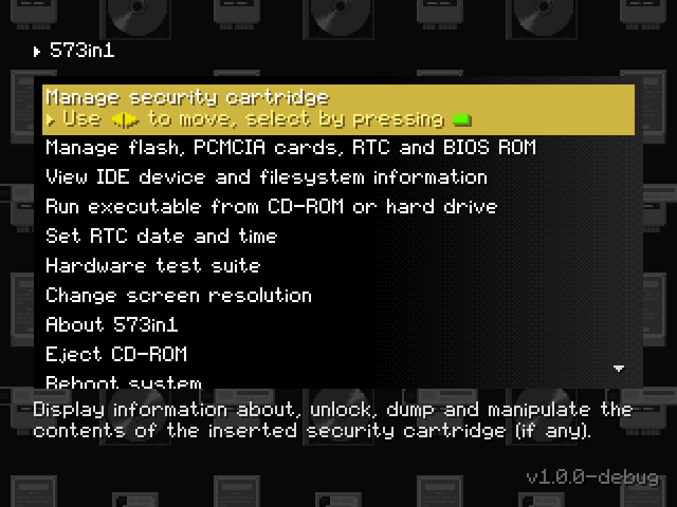
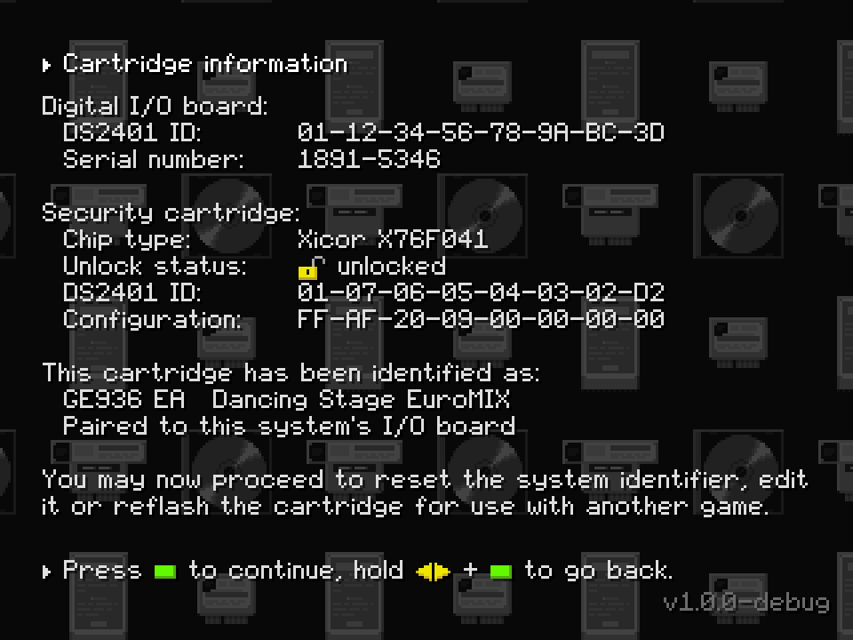
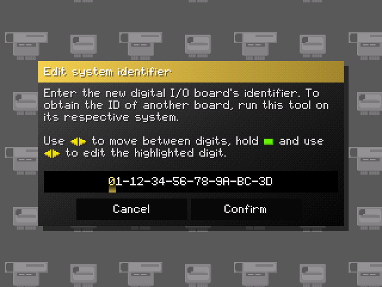
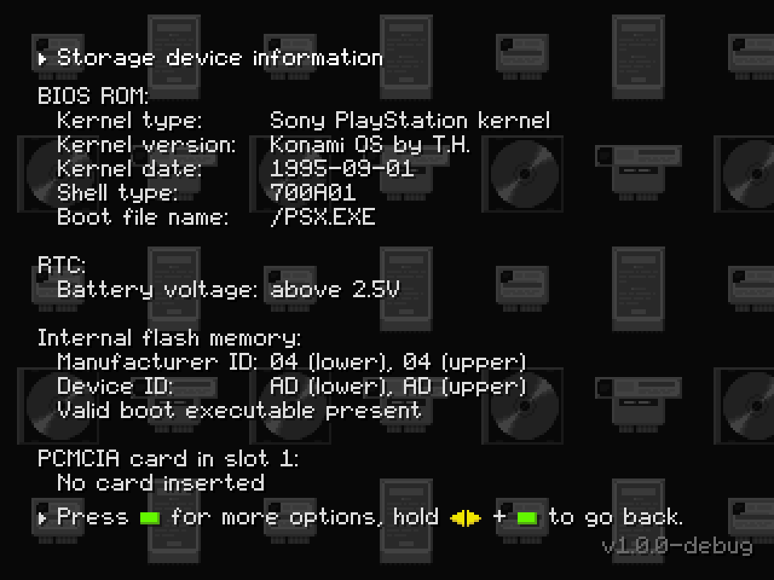
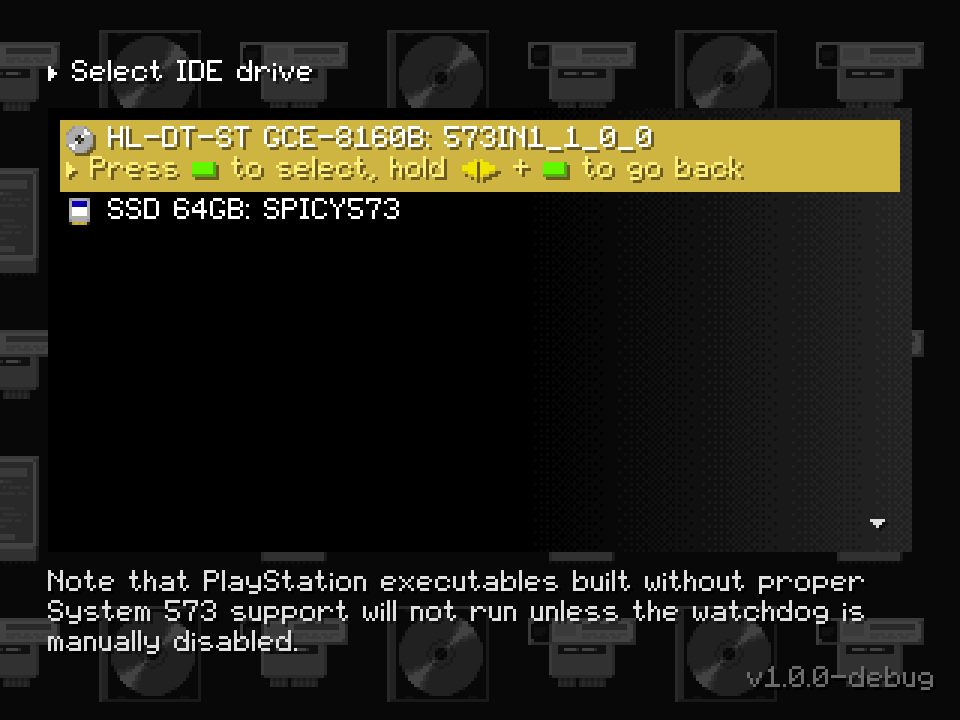
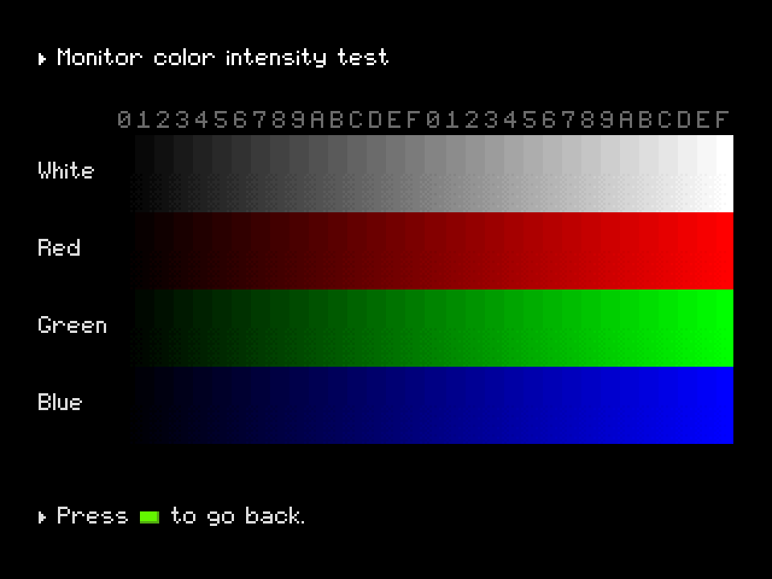

  

573in1 is a full-featured homebrew maintenance and troubleshooting tool, game
installer and BIOS ROM replacement for arcade games based on Konami's System 573
PCB, such as earlier versions of Dance Dance Revolution and other Bemani rhythm
games from the same era. It currently allows for:

- dumping, erasing and writing binary images to the onboard flash memory, PCMCIA
  flash cards and RTC RAM;
- dumping security cartridge EEPROMs and editing the serial number stored in
  them in order to reinstall a game on a different system;
- repurposing security cartridges for use with any game that uses the same
  cartridge type;
- browsing the CD-ROM, or any connected IDE hard drive or CF card, and launching
  System 573 and PS1 executables.

A secondary - but no less important - purpose of this project is to serve as a
testbed for System 573 reverse engineering and documentation efforts, by
providing an extensive ready-to-go user interface and hardware abstraction
library with (hopefully) easily readable code. The project may potentially be
expanded to support other similar PS1-based arcade PCBs in the future.

## Download and usage

The latest version of 573in1 can be found on the releases page, accessible
through the GitHub sidebar. Each release is available in three different
formats:

- as a CD-ROM image bootable on any 573 equipped with a compatible IDE optical
  drive, including ones fitted with BIOS mod boards and similar modifications;
- as a BIOS ROM image, allowing the system to boot directly into the 573in1 main
  menu (even with no drives connected) and optionally launch a game or custom
  executable automatically;
- as a standalone 573 executable file for advanced users.

See the [documentation](doc/index.md) for more information and usage
instructions. **Reading the documentation before proceeding is highly**
**recommended.**

## Screenshots

  
  
  
  
  
  

## Project status

While 573in1 has reached a point where it is fully functional and usable, it is
still a work-in-progress project with several features planned but not yet
implemented. The following tasks are planned for future releases, from highest
to lowest priority:

- Migrating the current game list format (`data/x76f041.db` and `data/zs01.db`)
  to a new single-file format, adding new fields and providing an updated Python
  script to generate it from `data/games.json`.
- Adding support for installing games that write installation metadata and a
  hash of the system's ID to the internal flash memory. This will require adding
  new data to the game list (see above) and reverse engineering all flash header
  formats used by games.
- Fixing a bunch of stability bugs, such as the executable loader occasionally
  crashing or the filesystem drivers not being thread safe (resulting in
  filesystem corruption if e.g. a screenshot is taken while dumping data to the
  hard drive).
- Adding support for installing arbitrary executables directly to the internal
  flash or a PCMCIA card, allowing the 573 BIOS to boot them automatically even
  with no CD-ROM drive present.
- Cleaning up the codebase, which currently contains *many* bad practices.
- Adding support for JVS bus scanning and using JVS I/O boards in place of the
  JAMMA button inputs.
- Adding UTF-8 support to the font and text rendering code. This is a rather low
  priority feature, but it would allow 573in1 to be translated to other
  languages.

## Contributing

Pull requests are welcome. If you wish to add functionality feel free to do so,
however please stick to the following guidelines:

- Do not include any code lifted as-is or minimally modified from a game
  disassembly. Rewritten and properly explained/commented code is fine.
- Do not include any Konami game files or excerpts thereof. If necessary, only
  include metadata about the files such as hashes, offsets, sizes and so on.
- Store any such metadata as a file in the resource archive (see
  `resources.json`) rather than hardcoding it. If possible, provide a copy of
  the scripts used to gather the data from the original files in the `tools`
  directory.
- Adding a section to the documentation covering usage of the newly added
  functionality is not required, but would be highly appreciated.

If you have any questions or doubts, or want to propose new features, feel free
to reach out to the authors by opening an issue or through one of the Discord
servers linked at the end of the page.

## License

573in1 is licensed under the [GNU GPLv3](LICENSE). You may freely distribute
modified versions as long as you do not relicense them and provide the full
source code, attribution and a link back to this repository.

Some files are adapted from other projects (namely,
[ps1-bare-metal](https://github.com/spicyjpeg/ps1-bare-metal)) or third-party
libraries and are more permissively licensed as a result. Refer to the license
information at the top of each file for more details.

## See also

If you are not already familiar with the inner workings of the PS1 and System
573, you may find the following links useful:

- [Konami's System 573 - Everything you wanted to know about it!](https://youtube.com/watch?v=Cm6ycmTbwIU)
  (video)
- [PlayStation Architecture](https://copetti.org/writings/consoles/playstation)

More in-depth technical documentation can be found here:

- [PlayStation specifications](https://psx-spx.consoledev.net/) (also includes a
  [573 section](https://psx-spx.consoledev.net/konamisystem573))
- [Naoki Saito's System 573 repo](https://github.com/NaokiS28/KSystem-573)

Discuss about 573in1, PS1 homebrew development, Konami arcade hardware and
related topics on:

- [PSX.Dev Discord server](https://discord.gg/QByKPpH)
- [Rhythm Game Cabs Discord server](https://discord.gg/MNcMGCE8sk)
