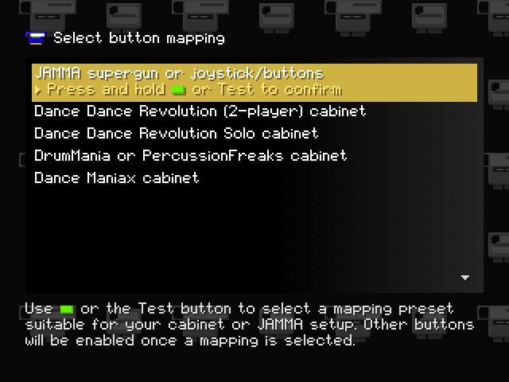

# User's manual

## Contents

- [Introduction](#introduction)
- [Getting started](#getting-started)
- [Unlocking and dumping cartridges](#unlocking-and-dumping-cartridges)
- [Editing the system identifier](#editing-the-system-identifier)
- [Converting cartridges](#converting-cartridges)
- [Connecting a hard drive](#connecting-a-hard-drive)
- [FAQ and troubleshooting](#faq-and-troubleshooting)

## Introduction

This tool will let you:

- inspect and dump the serial numbers and EEPROM contents of any System 573
  security cartridge;
- reset cartridges that have been paired to a 573's digital I/O board during
  installation, so that they can be reused on a different system;
- erase cartridges and convert them for use with any game that uses the same
  cartridge type;
- dump your 573's internal flash memory, RTC RAM, BIOS ROM as well as any PCMCIA
  flash cards inserted into it.

It will *not* let you:

- run System 573 games that require a security cartridge without owning one of
  the correct type;
- change your digital I/O board's serial number (it is stored in a read-only
  chip);
- get around a game's I/O board, PCMCIA card or other hardware requirements.

This guide assumes you already have some basic knowledge of System 573 hardware
(games, I/O board types and so on) and arcade hardware more in general. If not,
you may want to familiarize yourself with the basics before proceeding. Reading
this guide in its entirety before using the tool for the first time is highly
recommended as well.

### Disclaimer

This tool is provided with *no warranty whatsoever* and is not guaranteed to
work with your specific 573 setup or security cartridges. Additionally, it is
possible to **permanently brick** your cartridges by using it improperly. The
authors take no responsibility for cartridges bricked or otherwise damaged,
*even if accidentally or due to bugs*, by this tool.

## Getting started

In order to use the tool you will need the following:

- **A System 573** (`GX700-PWB(A)` PCB) equipped with a compatible ATAPI CD-ROM
  or DVD-ROM drive.
- **A JAMMA setup** consisting of an appropriate power supply, a monitor or
  upscaler capable of displaying 15kHz signals and *at least* the player 1 left,
  right and start buttons. If your 573 is installed in a DDR, DDR Solo,
  DrumMania or Dance Maniax cabinet you may leave it in there as the tool has
  mappings for the wiring of those cabinets' buttons. Note that JVS input
  devices connected to the JVS port of the 573 are currently not supported.
- **A blank CD-R to burn the tool to**. Depending on the drive installed in your
  573, a DVD-R, DVD+R or a rewritable disc (CD-RW, DVD-RW, DVD+RW) may also
  work.

You may additionally want the following optional items:

- **A digital I/O board** (`GX894-PWB(B)` PCB, also known as "MP3 board" or
  "digital sound PCB") mounted on top of the 573 motherboard. If one is
  installed, the tool will display its serial number and offer the ability to
  pair cartridges to it. If not, the serial number of any digital I/O board can
  still be entered manually.
- **An IDE hard drive, CF card, SD card adapter or IDE-to-SATA adapter**
  connected to the same IDE bus as the CD-ROM drive, for dumping cartridges or
  the 573's internal storage. See
  [Connecting a hard drive](#connecting-a-hard-drive) for more details.

To get started, burn the provided CD-ROM image to a disc using your burning tool
of choice, then remove any game disc from your 573 and replace it with your
burned disc. Make sure DIP switch 4 (the rightmost one) is off, turn on or power
cycle your 573 and, if everything goes well, it should boot into a warning about
security cartridges. Press the start button and you will get to this screen:

<p align="center">
  
</p>

Press the start button repeatedly until the button mapping that most closely
matches your setup is highlighted, then hold it down for about a second to
confirm your selection. From now on you will be able to navigate the tool using
the left and right (or up and down) buttons on your cabinet or JAMMA setup.

**NOTE**: the tool is also available as a self-contained executable (`.psexe`)
file in case you have another means of running arbitrary software on your
system. That said, if that is the case then you will likely not need to read
most of this guide.

## Unlocking and dumping cartridges

### Cartridge types

There are several different kinds of cartridges, most of which are equipped with
additional game-specific hardware such as serial ports, however all of them fall
into one of three categories depending on the actual security-related hardware
they feature:

- **X76F041**: the earliest and simplest cartridge type, consisting only of a
  512-byte password protected EEPROM. Used by early non-Bemani games.
- **X76F041 + DS2401**: similar to X76F041 cartridges but with an additional
  unique serial number (DS2401 chip), a copy of which is stored in the EEPROM
  and validated by the game. Used by most non-Bemani games, some early Bemani
  titles and as an installation cartridge for games with dual installation and
  game cartridges.
- **ZS01 + DS2401**: introduced with later Bemani games such as DDR 4thMIX,
  these were supposed to be more "secure" than their X76F041 counterparts. They
  offer 112 bytes of storage, support for identification without a password and
  *two* unique identifiers (only one of which is normally used).

There are actually two more cartridge types, based on the X76F100 EEPROM chip.
Even though support for these cartridges is present in virtually all 573 games,
there is no evidence whatsoever of them having ever been manufactured by Konami
and the tool does not support them currently.

### Unlocking a cartridge

All cartridges must be unlocked using an 8-byte key prior to reading or writing
their contents. This key is different for each game; the tool includes a list of
the most common 573 games with their respective keys. When first selecting
*Manage security cartridge* from the main menu, you will get to a screen
displaying basic information about your digital I/O board (if any) and the
cartridge:

<p align="center">
  
</p>

You will then have to unlock the cartridge by either selecting which game it
belongs to from the built-in list or entering a custom key manually.

**NOTE**: cartridges that have been previously erased and converted to another
game will require the new game's key, so the label on the cartridge may not
match the actual key required to unlock it. If the cartridge has been previously
erased but not converted, its key will be `00-00-00-00-00-00-00-00` by default.

As ZS01 cartridges allow for the first 32 bytes of data to be read without
providing a key, the tool will automatically read them and attempt to determine
which game the cartridge belongs to from those. If a match is found, an
appropriate unlocking key will be suggested and an option to use it will appear
at the top of the key list:

<p align="center">
  
</p>

Once a key is selected, if unlocking succeeds, the contents of the cartridge
will be read and the screen will be updated with information about them:

<p align="center">
  
</p>

If unlocking fails you may want to try using another key, however keep in mind
that all types of cartridges have lockout mechanisms to deter attempts to guess
the key:

- X76F041 and X76F041 + DS2401 cartridges will allow for up to (usually) either
  3 or 9 attempts depending on the game. If this number is exceeded without a
  successful unlock, **the chip will lock out any further access** and the
  cartridge will thus become **permanently bricked** with no way to restore
  access.
- ZS01 cartridges will similarly only allow for a limited number of unlock
  attempts, but exceeding it will only result in the contents of the EEPROM
  being erased and the key being reset to `00-00-00-00-00-00-00-00`, without
  bricking the chip.

### Saving cartridge dumps

After unlocking a cartridge, it is recommended to save a backup of its original
state before modifying its contents. The tool offers two different ways to dump
cartridges, either to a `.573` file on the currently connected IDE drive (see
[Connecting a hard drive](#connecting-a-hard-drive) for more details) or as a QR
code that can be scanned and converted to a dump file with the help of the
`decodeDump.py` Python script provided alongside the tool. A QR code dump will
look like this:

<p align="center">
  
</p>

When scanned, the code will yield the dump encoded as a string beginning with
`573::`. The dump can be decoded into readable data by invoking `decodeDump.py`
followed by the string enclosed in quotes in a terminal:

```
$ ./decodeDump.py "573::OGI8AP ... 8K2000::"
Digital I/O ID:    01-12-34-56-78-9a-bc-3d
Digital I/O SN:    2990-0818

Cartridge type:    Konami ZS01 (PIC16CE625)
DS2401 identifier: 01-07-06-05-04-03-02-d2
...
```

`decodeDump.py -i` can also be used to display the contents of a dump file:

```
$ ./decodeDump.py -i path/to/dump.573
Digital I/O ID:    01-12-34-56-78-9a-bc-3d
Digital I/O SN:    2990-0818

Cartridge type:    Konami ZS01 (PIC16CE625)
DS2401 identifier: 01-07-06-05-04-03-02-d2
...
```

See [Data formats](formats.md) for a technical breakdown of the dump format.

## Editing the system identifier

TODO: add this section

## Converting cartridges

TODO: add this section

## Connecting a hard drive

TODO: add this section

## FAQ and troubleshooting

### I cannot get past the BIOS "hardware error" screen and into the tool

- Make sure the disc image has been burned correctly (and not by e.g. dragging
  the image file onto the disc). The disc should contain a bunch of files named
  `README.TXT`, `PSX.EXE` and so on.
- Try using a different disc and/or another CD-ROM drive. A list of drives known
  to be compatible with the 573 BIOS can be found
  [here](https://psx-spx.consoledev.net/konamisystem573/#known-working-replacement-drives).
- Ensure the BIOS is not reporting an actual hardware error with the 573. A
  CD-ROM error will result in `CDR BAD` being displayed, while other errors will
  be reported with the chip that failed. A list of chips checked by the BIOS can
  be found [here](https://psx-spx.consoledev.net/konamisystem573/#boot-sequence).

### I get an error about the CD-ROM being incorrect

- You have booted into the game installed on the 573's flash rather than from
  the disc. Turn off DIP switch 4 (the rightmost one) and power cycle the 573.

### My cartridge does not get recognized

- Try scraping off any oxidation layer from the cartridge's contacts by rubbing
  them gently using an eraser and cleaning them.
- Ensure the security cartridge connector on the 573 is not worn out, corroded
  or otherwise damaged.

### My IDE drive, CF card or adapter does not get recognized

- Try using a different drive or adapter. Some CF cards, SD card adapters and
  IDE-to-SATA converters are known to be problematic.
- Ensure the drive is formatted with a single FAT32 or exFAT partition. Other
  file systems such as NTFS are not supported.

### How do I obtain more information about an error that happened?

- You may press the test button on your 573 or cabinet at any time to toggle the
  log window, which will contain detailed information about errors.
